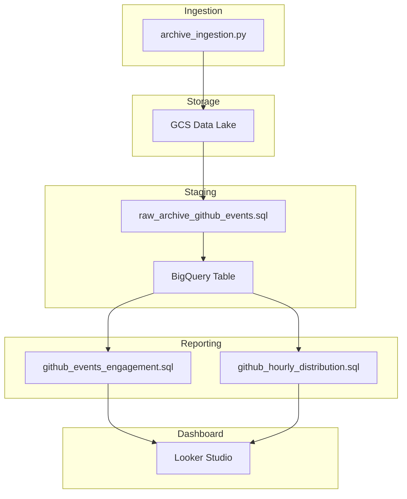

# GitHub Insights: Exploring Developer Activity

Welcome to GitHub Insights, a project built as part of Data Talk Club DE Zoomcamp! This repository showcases a full end-to-end data pipeline that processes GitHub event data. Throughout this project, I applied and strengthened key skills from the course
## Project Objective
The goal of GitHub Insights is to turn raw GitHub activity data into actionable insights while showcasing a complete end-to-end data pipeline built with **Bruin**. In this project, I have:

* Ingested and staged large-scale GitHub event data efficiently in a data lake.
* Transformed and enriched the data in a data warehouse, preparing it for advanced analytics.
* Analyzed developer and repository activity to uncover patterns, trends, and engagement metrics.
* Visualized findings in interactive dashboards, highlighting the most popular repositories and time-of-day activity.

## Architecture / Pipeline Overview

This project implements a modern data pipeline architecture, transforming raw GitHub event data into structured insights through multiple stages. The pipeline is orchestrated using **Bruin**, ensuring reproducibility and clear dependency management.

### Pipeline Flow
1. Data Ingestion (Data Lake)
    * Raw GitHub Archive data (JSON .gz files) is ingested and stored in Google Cloud Storage (GCS).
    * The data is organized by year/month/day partitions for efficient access and scalability.
2. External Table (BigQuery)  
    An external table is created in BigQuery, directly querying raw files from GCS.
3. Staging Layer  
    Raw nested JSON data is flattened and cleaned into a structured format.  
    Key fields extracted: id, type, repo_name, actor_login, created_at, date, hour (this step standardizes the dataset and prepares it for downstream transformations).
4. Data Warehouse (Core Table)
    * Cleaned data is stored in a partitioned BigQuery table:raw_archive.github_events
    * Incremental loading is handled via MERGE strategy, ensuring efficient updates without duplication.
5. Reports Layer  
    Analytical models are built on top of the staging data, including:  
      * Repository engagement metrics
      * Hourly activity distribution
6. Visualization Layer  
    Final datasets are connected to Looker Studio dashboards.
### Key Technologies Used
* Bruin → pipeline orchestration & asset management
* Google Cloud Storage (GCS) → data lake
* BigQuery → data warehouse & transformations
* SQL → data modeling and analytics
* Looker Studio → dashboarding and visualization

## How to run the project
This project uses **Bruin** to orchestrate an end-to-end data pipeline for GitHub event data. The pipeline is divided into ingestion, staging, and reporting assets, each of which can be run independently or as part of the full workflow.
1. [archive_ingestion.py](./assets/ingestion/archive_ingestion.py)  
   Responsible for loading raw GitHub Archive files into GCS. Files are stored in a structured path: gs://bucket/year=YYYY/month=MM/day=DD/*.json.gz
2. [raw_archive_github_events.sql](./assets/staging/raw_archive_github_events.sql)  
   Read raw data from GCS (JSON files are stored in a semi-structured format).  
   Creates an external table in BigQuery pointing to those files.  
   Transform and normalize the data by extracting needed fields: id, type, repo_name, actor_login, created_at.  
   Converts timestamps to proper TIMESTAMP types.  
   Splits date and hour for easier aggregations.  
   Writes the cleaned and typed data into raw_archive.github_events.  
   Uses merge strategy so new data can be added incrementally without duplicating existing rows.  
   Prepare the data for reporting.  
[raw_archive_github_events.py](./assets/staging/raw_archive_github_events.py)  is doing the same thing, but locally. It takes all files, process them locally with pandas and uploads them to BigQuerry. It is so resource expensive and I designed it before this sql asset (processing of one day took ona hour ). Decided to leave it there for comparing speeds of local and cloud computing.
3. [github_events_engagement.sql](./assets/reports/github_events_engagement.sql)  
   It computes: Total events per repository, Engagement events (Pull Requests,Issues,Comments), Engagement percentage and powers the “Most Popular Repositories” dashboard  
   [github_hourly_distribution.sql](./assets/reports/github_hourly_distribution.sql)  
   It computes: Number of events per hour (0–23) focused on engagement-related activity and powers the “Time-of-Day Activity” dashboard
4. Running the pipeline  
   bruin run \  
  --start-date 2026-01-01 \  
  --end-date 2026-01-31 \  
  -e default  

***Note*** 
While ingestion and transformation processes has been done manually in this project for demonstration purposes, the entire GitHub Archive dataset is already available as a public BigQuery dataset [githubarchive](https://console.cloud.google.com/bigquery?project=githubarchive&page=project&ws=!1m0). This means in practice, you can skip the manual ingestion and directly start from the data warehouse for analytics and dashboard creation.  
Performing the ingestion manually allowed me to explore:
* Schema design for semi-structured event data
* Incremental MERGE operations in BigQuery
* Staging pipelines for large datasets

